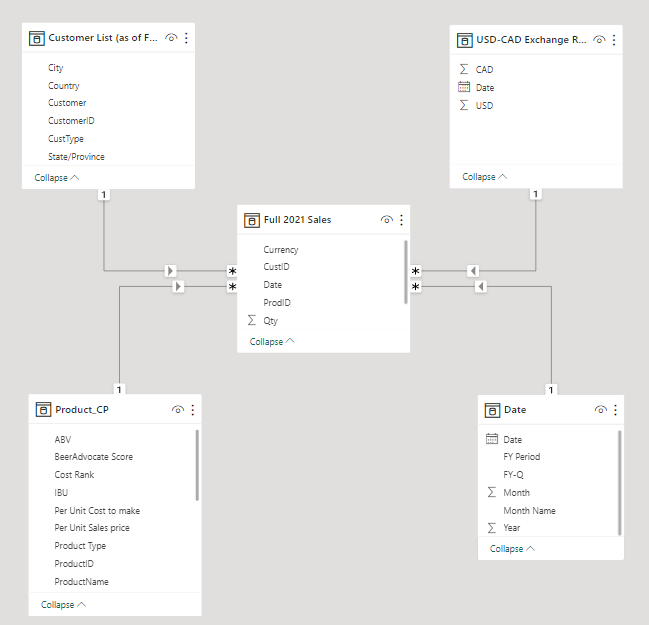
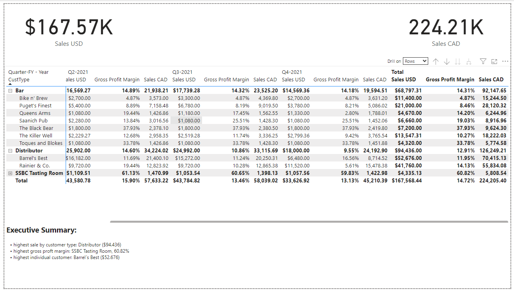
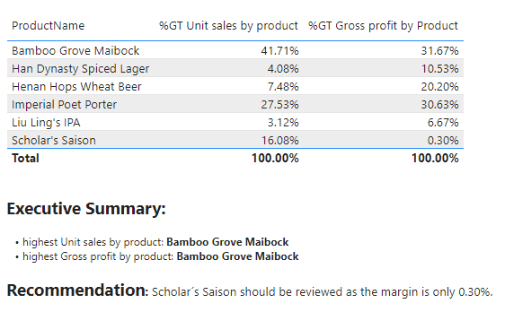

# Create a Data Model for Seven Sages Brewing Company

## Table of Contents
 * [Project Motivation](#project-motivation)
 * [File Descriptions](#file-descriptions)
 * [Step 1 Get data](#step-1-get-data)
 * [Step 2 Structure, Combine and Clean data](#step-2-structure-combine-and-clean-data)
 * [Step 3 Create Data Table](#step-3-create-data-table)
 * [Step 4 Build Relationships Between Tables](#step-4-build-relationships-between-tables)
 * [Step 5 Measures](#step-5-measures)
 * [Step 6 Create a Report](#step-6-create-a-report)

### Project Motivation

The goal of this project is to create an efficient data model for a small brewing company. The business value is that it will help the company identify popular and profitable products. This will help them making smarter business decisions. The project requires understanding of data modeling principles. Data is cleaned and organized in Power Query, DAX measures are used for calculations. This project took about 3 days to complete.

### File Descriptions

/data

- `CFO Metrics Tracker.xlsx`: 
- `Customer List (as of FY2021).txt`: Customer records 
- `SSBC Product Offerings.pdf`: Company´s current product offerings
- `USD-CAD Exchange Rates.csv`: USD-CAD exchange rates

/data/monthly-sales/

- `SSBC - <month> <yyyy> Sales`: dates of purchases provided in multiple excels

### ETL with Power Query

#### Step 1 Get data

- Upload SSBC Product Offerings PDf
- Upload Sales Log folder
- Upload CFO Metrics Tracker
- Upload USD-CAD Exchange rates
- Upload Customer List

#### Step 2 Structure, Combine and Clean data

- promote first rows to headers as needed
- review data types for each field
- rename any ambiguous queries
- rename unclear columns
- merged dimension tables with a 1:1 relationship
- removed any and all blank rows
- deleted unnecessary columns

#### Step 3 Create Data Table
- Created dynamic `Date` Table
    - defined Start: `= {Number.From(#"Start")..Number.From(#"End")}`
    - defined End: `= Date.EndOfYear(List.Max(#"Table"[Date_Column]))`
    - Transform to Table: `= {Number.From(#"Start")..Number.From(#"End")}`
    - created `FY Period`, `FY Year`, `FY Quarter`

> Note: Seven Sages' Fiscal year begins on October 1st and runs until September 30th.

#### Step 4 Build Relationships Between Tables

#### Step 5 Measures

Created columns:

- Sales ($USD)
- Sales ($CAD)
- Cost of Sales ($USD)
- Gross profit Margin (%)
- Unit Sales by Product (%, USD)
- Gross Profit by Product (%, USD)

#### Step 6 Create a Report

### Acknowledgements

- udacity for providing this project
- my employer for giving me the opportunity to upskill

