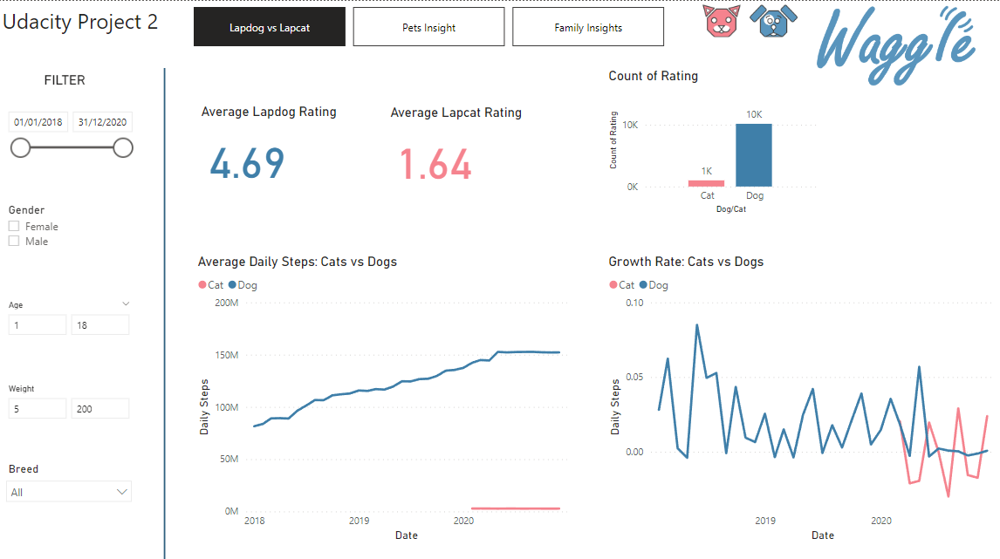
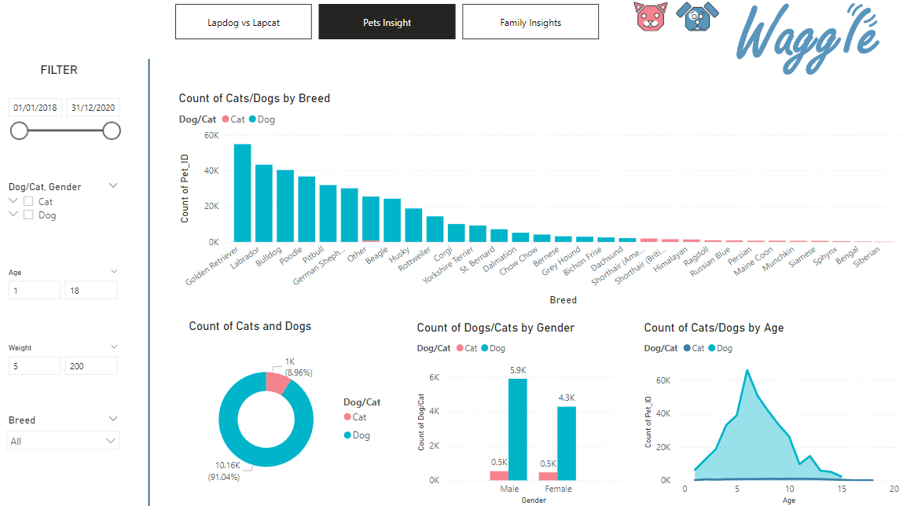
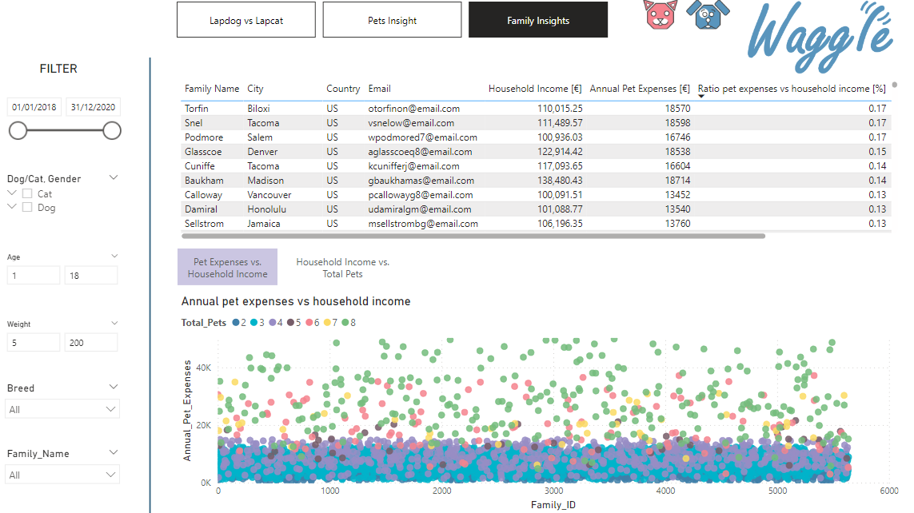

# Building a Power BI Report for Waggle

## Table of Contents
 * [Project Motivation](#project-motivation)
 * [Business Requests](#business-requests)
 * [Project Steps](#project-steps)
 * [File Description](#file-description)
 * [Results](#results)
 * [Acknowledgements](#Acknowledgements)

### Project Motivation

In this project, we pretend to be a business intelligence analyst for Waggle, a startup that makes smart devices for pets. Recently, Waggle has been thrilled by the success of their new Lapdog device, a fitness collar that lets owners track their dog’s steps, alerts them when it’s time for a walk, and even repels fleas! Reviews have been fantastic, sales are growing, and—best of all—the product really works!

This success has led Waggle’s CEO to push for a feline version but there are concerns about its viability. For this reason, the product team distributed 1,000 Lapcat prototypes for field testing. Now, after months of data collection, we have been tasked with delivering a boardroom-ready Power BI report that tells the story of how the Lapcat data compares to findings from the dog collar Lapdog devices. 

### Business Requests

The CEO is curious about the following questions:

- Did the average daily steps increase for cats wearing the device as they did for dogs?
- **Answer**: For cats, there was no increase in average daily steps visible. For dogs, the monthly steps growth rate was between 0-8%. The highest increase was in June 2018 (8%).
- Were owners of Lapcat devices as satisfied with the product as Lapdog owners?
- **Answer**: No. The average rating for Lapdog is 4.69/5 (10161 votes), the rating for Lapcat is 1.64 (1000 votes).
- The Chief Marketing Officer would like your report to be “on-brand” by including only colors from the Waggle color palette, the Waggle logo, and other approved company logos and icons.
- **Answer**: See report.
- The product team trusts you to incorporate other visuals and insights as you see fit but is most interested in demographic comparisons between the dogs and cats using Waggle devices as well as any information about the families who own the pets. They would also like slicers to help them filter and explore on their own.
- **Answer**: See report.

### Project Steps

1. Review  data model and business questions and identify which fields can be used to design metrics that answer the CEO’s questions. 

2. Develop one or more visualizations that specifically address the CEO’s questions about whether there was a difference in average daily steps over time between the two devices and how Lapcat owners rated their device compared to Lapdog owners.

3. Address the product team’s request for demographic insights, using each of the following visuals at least once: Bar chart, line chart, donut chart, table/matrix, scatter plot, bubble map, and card.

4. Place your data visualizations and design an appropriate layout that emphasizes the most important findings first, with the CEO's questions answered on the first page, insights about the differences between dogs and cats on the second, and insights about the families who own the pets on the third.

5. In your data visualizations, incorporate the branding elements requested by the Chief Marketing Officer.

6. Please include at least five slicers on each page with at least one example of a drop-down slicer, at least one example of a slider slicer, at least one example of a hierarchy slicer, at least one example of a slicer with “Select All” enabled, and one example of a slicer with the search box enabled.

7. Create at least two bookmark features. One must allow users to dynamically swap one visual out with a different one and another must reset all applied filters on the page.

8. Create buttons that help your users navigate your report. Buttons must respond when users hover over them by changing color or size (or both!).

### File description

A data model (`student-starter-file.pbix`) was provided by udacity, as well as a variety of Waggle marketing images and branding guidelines (`marketing_collatoral/`*). The data is in `sample-datasets-for-pbi.xlsx`.

### Results

### Acknowledgements

- udacity for providing this project.
- my employer for giving me the time to upskill.
