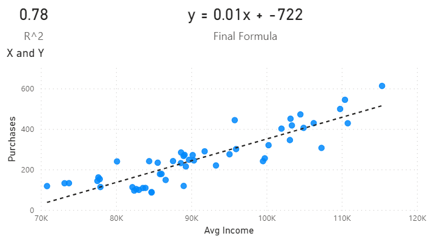

# Market Analysis Report for National Clothing Chain

## Table of Contents
 * [Project Description](#project-description)
 * [Project Instructions](#project-instructions)
 * [Data](#data)
 * [Project Questions](#project-questions)
 * [Results](#results)
 * [Acknowledgements](#Acknowledgements)

### Project Description

An online national clothing chain needs your help creating a targeted marketing campaign. Sales have been flat and they want to lure lost customers back. They want to advertise specific products to specific customers in specific locations, but they don’t know who to target. They have three products in mind:

- Shirt: $25
- Sweater: $100
- Leather Bag: $1,000

### Project Instructions

- Use population statistics from the US Census Bureau to determine where the greatest income exists around the country and whether there is a correlation between sales and income. 
- predict customer income by looking at the purchase history and locations and comparing that against census data.
- analyze inventory, specifically customer ratings and return rate & see if there is a correlation.

### Data

US Census Bureau

- Average income
- location
- population
- industry

Business Data

- Product inventory
- Product prices
- Customer rating
- Product return rate

Customer Data

- Customer ID
- Names
- Location
- Date of birth
- Purchase history

Additional Data

- WeatherWeather
- Economics
- Demographics
- Competition

### Project Questions

1. What is the correlation (R2 value) between sales and income? **Answer: 0.78** 
2. What is the correlation (R2 value) between customer ratings and product return rate? **Answer: 0.47** 
3. What are the linear regression formulas to predict customer income from customer sales? 
**Answer: y = 0.01x - 722** 
4. Which customer do you predict has the highest income? **Answer: JLit30836: 597200$**
5. Which product will be advertised the most? **Answer: "Long Dress as it has the most stock and is fairly cheap. Furthermore, "Sweater Dress" and "Leather Bag" will be adversised, they both have sufficient stock as well as a good Return Rate**

### Results:

#### Income Distribution: Histogram

#### Household Income by Location: Map

#### Correlations: Scatter Plot with Trendline and Card with R^2 value

#### Predicted Income per Customer

### Acknowledgements
