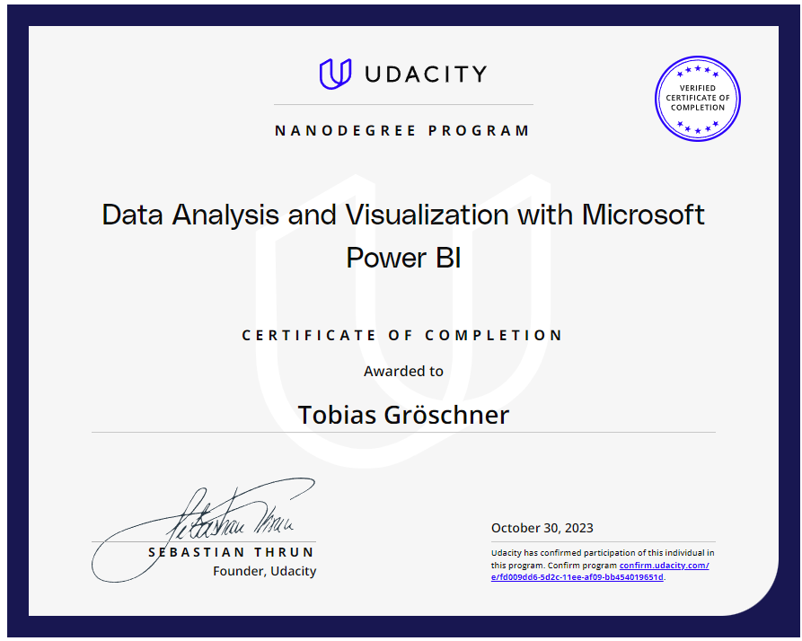

# Udacity Data Analysis and Visualization with Microsoft PowerBI

This repository is for projects in [Udacity's Data Analysis and Visualization with Microsoft PowerBI](https://www.udacity.com/course/data-analysis-and-visualization-with-power-BI-nanodegree--nd331) that covers data-pre-processing, visualization and analysis using Power BI as a primary tool. The course is beginner-level and takes approximately 3 months to complete.

Each project contains a detailed README file documenting the project description and findings.

## Nanodegree Projects

| Project No. | Project |
| ---		  | ----    |
| 01		  | [Create a Data Model for Seven Sages Brewing Company](/Project-1/) 	|
| 02 		  | [Building a PowerBI Report for Waggle](/Project-2/) 								|
| 03 		  | [Market Analysis Report for National Clothing Chain](/Project-3/)	|

## Nanodegree Certificate

